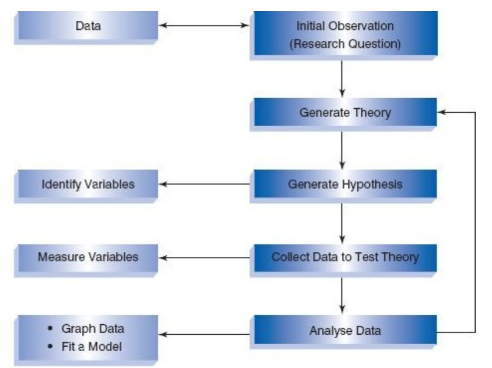
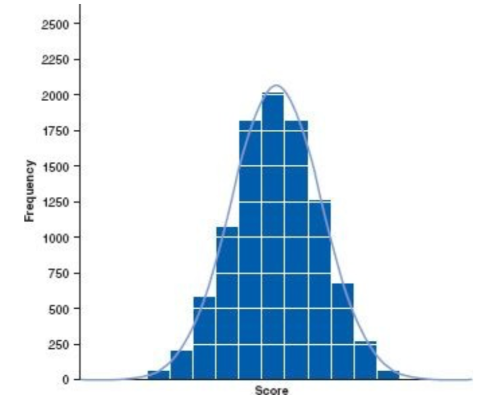
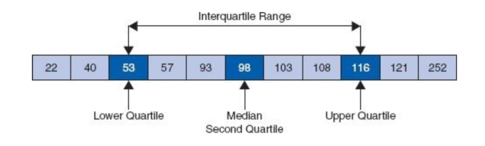

# Chapter 1

## Goal
**identify and measure cause and effect!**

## Research Process

- [x] **quantitative methods**
- [ ] **qualitative methods** 

	

* **theory**
* **hypothesis**: a prediction from a theory.
	* **alternative hypothesis**: a position that states something is happening.
	* **null hypothesis**: a default position that there is nothing new happening, e.g., there is no association among groups or no relationship between two measured phenomena.
* **scientific statement** can be proved or disproved (**falsification**) empirically.
* good theories should produce hypotheses that are scientific statements.

## Variable

* **independent variable** = **predictor variable**: a variable thought to be the cause of some effect.
* **dependent variable** = **outcome variable**: a variable thought to be affected by changes in an independent variable.
* **level of measurement**: the relationship between **what is being measured** and the **numbers that represent** what is being measured.
	* **categorical variable** = **discrete variable**: distinct entities, e.g. human, cat, etc.
		* **nominal variable**: a variable that has two or more categories.
		* **binary variable**: a nominal variable that has only two categories, e.g. alive or dead, yes or no, etc.
		* **ordinal variable**: a nominal variable that is ordered or ranked, e.g. "not very much", "ok", "a lot", etc.
	* **continuous variable**: it can be scored on any value on the measurement scale.
		* **interval variable**: e.g. the difference between helpfulness ratings of 1 and 2 is the same as that of 3 and 4.
		* **ratio variable**: a interval variable whose ratio along the scale is also meaningful, e.g. a reaction time of 200ms is twice as long as a reaction time of 100ms, and twice as short as a reaction time of 400ms.

## Measurement
* **measurement error**: a discrepancy between the numbers we use to represent the thing we are measuring and the actual value of the thing wer are measuring.

* properties of measure to ensure that measurement error is kept to a minimum:
	* **validity**: whether an instrument **actually** measures what it sets out to measure.
		* **criterion validity**: the extent to which a measure is **related** to an outcome.
		* **content validity**: the extent to which a measure **represents all facets of a given construct**.
	* **reliability**: whether an instrument can be interpreted **consistently** across different situations.
		* **test-retest reliability**

## Research Method

two ways to test a hypothesis: 
* **correlational research** = **cross-sectional research**: we observe what naturally goes on in the world without interfering with it.
	* we only observe the **co-occurrence** of variables, and we cannot say which variable causes a change in the other.
* **experimental research**: we manipulate one variable to see its effect on another.
	* **confounding variable** = **confound**: a variable that influences both the dependent variable and independent variable, causing a spurious association.
	* to rule out confounding variables, **experimental methods** strive to provide a comparison of situations (**treatments** or **conditions**) in which the proposed cause is present or absent.

## Data Collection
* **between-subjects**, **between-groups**, **independent-measures design**
* **within-subject**, **repeated-measures design**

* **unsystematic variation**: small differences in performance created by unknown factors.
* **systematic variation**: differences in performance by a specific experimental manipulation.
* in both independent-measures and repeated-measures designs, it is important to keep the unsystematic variation to a minimum.
* **randomization**: 
	* in a repeated-measures design, we eliminate **practice effects** and **boredom effects** by **counterbalancing** the order in which a person participates in a condition.
	* in an independent-measures design, we ensure the confounding variables are **evenly distributed** across conditions.

## Data Analysis
* **frequency distribution** = **histogram**
	* **normal distribution**
* **median**, **mode** (the score that occurs the most), **mean**
* **range**, **interquartile range**

	
	

## Confidence

## Test Statistic

we can test whether our statistical **models** (and therefore our **hypotheses**) are significant **fits of the data** we collected.

**test statistic** 
	= (variance explained by the model) / (variance not explained by the model) 
	= (systematic variation) / (unsystematic variation) 
	= effect / error
