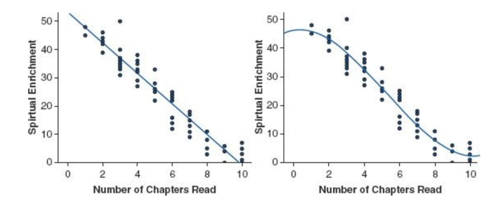
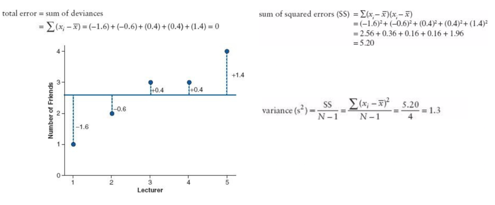
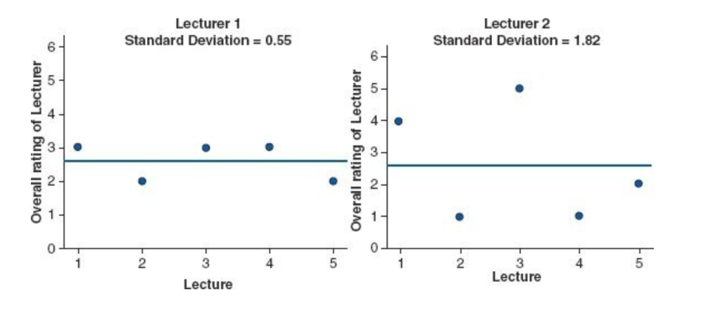
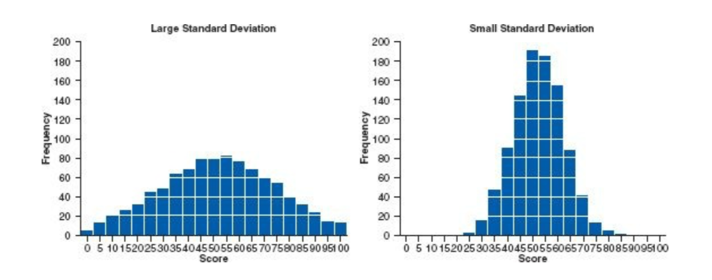
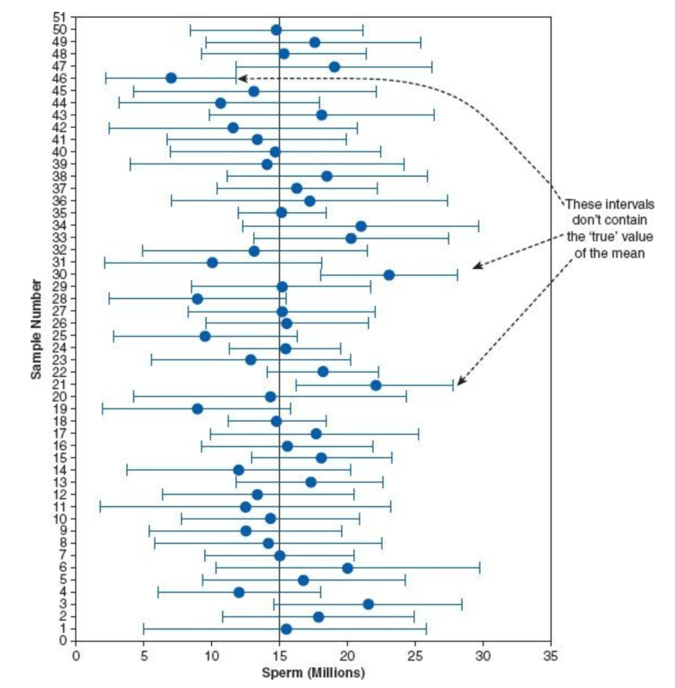

# Chapter 2

## Core
**observedi = (model) + errori**

**deviation = &Sigma;(observed - model)2**

## Model

**linear model** vs **non-linear model**:

	

**sample**: the data collected from a small subset of the **population**, which is used to infer things about the population as a whole.

measures of how well the model fits:
- [ ] **mean**
- [ ] **deviance**
- [x] **sum of squared error**
- [x] **variance**: the average error between the mean and the observations = a measure of how well the model **fits** the actual data.
	* **degree of freedom**
- [x] **standard deviation**

	

**the standard deviation is a measure of how well the mean represents the data.**
* left: the mean is a good fit to the data
* right: the mean is NOT a good fit to the data

	

**the standard deviation tells the shape of the distribution of scores**

	

**sampling variation**: samples will vary because they contain different members of the population.

**sampling distribution**: the frequency distribution of **sample means** from the same population.
* when samples > 30, sampling distribution = **normal distribution**
* when samples < 30, sampling distribution = **t-distribution**

**standard error of the mean**: the standard deviation of **sample means** = a measure of how well a sample is representative of the population.

**confidence interval**: 
* if **the mean represents the true mean** well, then 95% of the **confidence interval of that mean should be small**.
* if two means' **confidence intervals overlap**, these means could plausibly come from the **same population**.
* if two means' **confidence intervals do not overlap**, then we can infer that these means are from **different populations**.
* a confidence interval for the mean is a range of scores constructed such that the **population mean** will fall within this range **in 95% of samples**.

	

**test statistic**
* we can test whether our statistical **models** (and therefore our **hypotheses**) are significant **fits of the data** we collected.
* **test statistic**  = (variance explained by the model) / (variance not explained by the model) = (systematic variation) / (unsystematic variation) = effect / error
* the bigger the test statistic is, the more **unlikely** it is to **occur by chance**.
