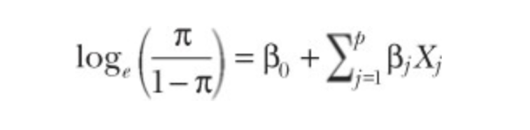
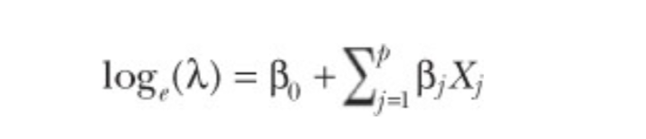
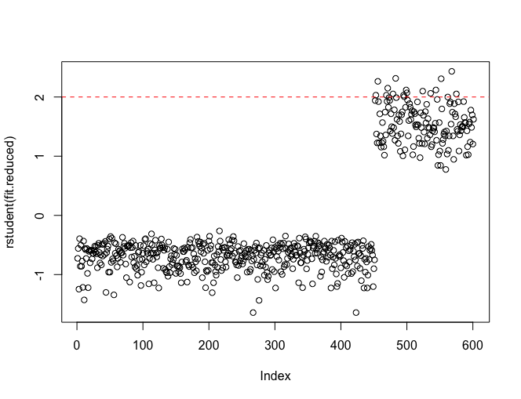
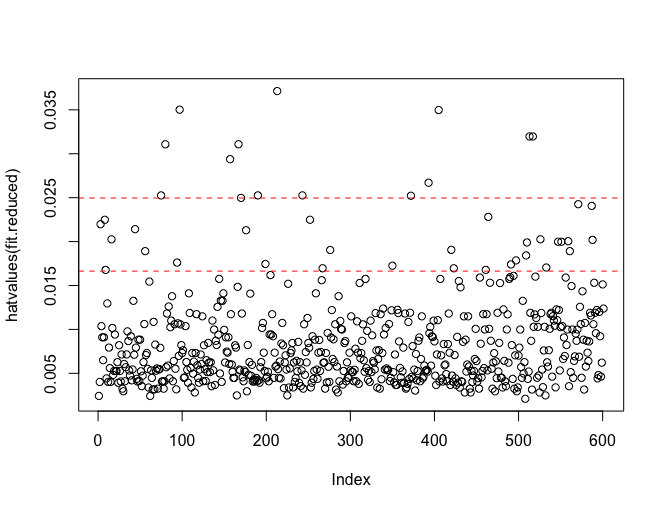
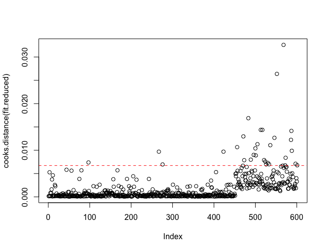

# Generalized Linear Model

## Overview

Linear models can be used to predict a **normally distributed response variable** from a set of continuous and/or categorical predictor variables

There are situations in which the dependent variable isn't normally distributed (or even continuous):
* the outcome variable may be **categorical**:
  * **binary variables** (yes/no, passed/failed, lived/died)
  * **polytomous variables** (poor/good/excellent, republican/democrat/independent)
* the outcome variable may be **a count**:
  * the number of traffic accidents in a week, the number of drinks per day
  * such variables take on a limited number of values and are never negative
  * **their mean and variance are often related** (which isn't true for normally distributed variables)

**Generalized linear models** extend the linear-model framework to include dependent variables that are **non-normal**
* **logistic regression**: the dependent variable is categorical
* **Poisson regression**: the dependent variable is a count variable

## The glm() function

### Equation

* this equation states that the **conditional mean** of the response variable is a linear combination of the predictor variables
* the β<sub>j</sub> parameters specifies the expected change in Y for a unit change in X<sub>j</sub>
* no distributional assumptions are made about the predictor variables, and X is not required to be normally distributed and is often categorical (e.g. ANOVA designs)
* nonlinear functions of the predictors are allowed

<p float="left">
  
</p>


* g(μ<sub>Y</sub>) is a function of the conditional mean = **link function**
* you relax the assumption that Y is normally distributed
* you specify the link function and the probability distribution
* the parameters are derived through an iterative **Maximum Likelihood Estimation** (OLS regressions use **Least Squares**)

<p float="left">
  
</p>

### glm() parameters

glm(formula, family = family(link = function), data = ?)

* binomial(link = "logit")
* gaussian(link = "identity")
* gamma(link = "inverse")
* inverse.gaussian(link = "1/mu^2")
* poisson(link = "log")
* quasi(link = "identity", variance = "constant")
* quasibinomial(link = "logit")
* quasipoisson(link = "log")

### Logistic regression

* π = μ<sub>Y</sub> is the conditional mean of Y (the probability that Y = 1 given a set of X values)
* π / (1 - π) is the odds that Y = 1
* log(π / (1 - π)) is the log odds = logit = link function
* the probability distribution is binomial
* glm(Y ~ X1 + X2 + X3, family = binomial(link = "logit"), data = mydata)

<p float="left">
  
</p>

### Poisson regression
* λ is the mean (and variance) of Y
* log(λ) = link function
* the probability distribution is poisson
* glm(Y ~ X1, X2, X3, family = poisson(link = "log"), data = mydata)

<p float="left">
  
</p>

### Standard linear model
* a special case of the generalized linear model
* g(μ<sub>Y</sub>) = μ<sub>Y</sub> = link function = identity function
* the probability distribution is normal (Gaussian)
* glm(Y ~ X1 + X2 + X3, family = gaussian(link = "identity"), data = mydata) = lm(Y ~ X1 + X2 + X3, data = mydata)

**to summarize**:
* generalized linear models extend the standard linear model by fitting **a function of the conditional mean response** (rather than the conditional mean response)
* it assumes that the response variable follows a member of **the exponential family of distributions** (rather than being limited to the normal distribution)
* the parameter estimates are derived via **maximum likelihood** (rather than least squares)

Supporting functions:
* summary(): display detailed results for the fitted model
* coefficients(), coef(): list the model parameters (intercept and slopes)
* confint(): provide confidence intervals for the model parameters (95% by default)
* residuals(): list the residual values in a fitted model
* anova(): generate an ANOVA table for a fitted model
* plot(): generate diagnostic plots for evaluating the fit of a model
* predict(): use a fitted model to predict response values for a new dataset
* deviance(): deviance for the fitted model
* df.residual(): residual degrees of freedom for the fitted model

## Model fit and regression diagnostics

```
# outlier
plot(rstudent(fit.reduced))
abline(h = c(-2, 2), col = "red", lty = 2)
```

<p float="left">
  
</p>

```
# high-leverage observations
plot(hatvalues(fit.reduced))
p <- length(coef(fit.reduced))
n <- length(fitted(fit.reduced))
abline(h = c(2,3)*p/n, col = "red", lty = 2)
```

<p float="left">
  
</p>

```
# influential observations
plot(cooks.distance(fit.reduced))
p <- length(coef(fit.reduced))
n <- length(fitted(fit.reduced))
cutoff <- 4 / (n - p - 1)
abline(h = cutoff, lty = 2, col = "red")
```

<p float="left">
  
</p>

## Sample code

### Logistic regression

Logistic regression is useful when you are predicting a binary outcome from a set of continuous and/or categorical predictor variables

```
data(Affairs, package = "AER")

summary(Affairs)
table(Affairs$affairs)

Affairs$ynaffair[Affairs$affairs > 0] <- 1
Affairs$ynaffair[Affairs$affairs == 0] <- 0
Affairs$ynaffair <- factor(Affairs$ynaffair, levels = c(0, 1), labels = c("No", "Yes"))
table(Affairs$ynaffair)

fit.full <- glm(formula = ynaffair ~ gender + age + yearsmarried + children + religiousness + education + occupation + rating,
           family = binomial(), 
           data = Affairs)
summary(fit.full)

fit.reduced <- glm(formula = ynaffair ~ age + yearsmarried + religiousness + rating,
                family = binomial(), 
                data = Affairs)
summary(fit.reduced)

anova(fit.reduced, fit.full, test = "Chisq")
```

**analysis of the result**:
* each regression coefficient in the reduced model is statistically significant (p < 0.05)
* because the full model and the reduced model are nested (fit.reduced is a subset of fit.full), you can use the anova() function to compare them

```
Call:
glm(formula = ynaffair ~ age + yearsmarried + religiousness + 
    rating, family = binomial(), data = Affairs)

Deviance Residuals: 
    Min       1Q   Median       3Q      Max  
-1.6278  -0.7550  -0.5701  -0.2624   2.3998  

Coefficients:
              Estimate Std. Error z value    Pr(>|z|)    
(Intercept)    1.93083    0.61032   3.164    0.001558 ** 
age           -0.03527    0.01736  -2.032    0.042127 *  
yearsmarried   0.10062    0.02921   3.445    0.000571 ***
religiousness -0.32902    0.08945  -3.678    0.000235 ***
rating        -0.46136    0.08884  -5.193 0.000000206 ***
---
Signif. codes:  0 ‘***’ 0.001 ‘**’ 0.01 ‘*’ 0.05 ‘.’ 0.1 ‘ ’ 1

(Dispersion parameter for binomial family taken to be 1)

    Null deviance: 675.38  on 600  degrees of freedom
Residual deviance: 615.36  on 596  degrees of freedom
AIC: 625.36

Number of Fisher Scoring iterations: 4
```

```
anova(fit.reduced, fit.full, test = "Chisq")
```

**analysis of the result**:
* the nonsignificant chi-square value (p = 0.21) suggests that the reduced model with four predictors fits as well as the full model with nice predictors

```
Analysis of Deviance Table

Model 1: ynaffair ~ age + yearsmarried + religiousness + rating
Model 2: ynaffair ~ gender + age + yearsmarried + children + religiousness + 
    education + occupation + rating
  Resid. Df Resid. Dev Df Deviance Pr(>Chi)
1       596     615.36                     
2       592     609.51  4   5.8474   0.2108
```

```
coef(fit.reduced)
exp(coef(fit.reduced))
```

**analysis of the result**:
* the odds of an extramarital encounter are increased by a factor of 1.106 for a one-year increase in years married (holding age, religiousness and rating constant)
* the odds of an extramarital encounter are multiplied by a factor of 0.965 for every year increase in age
* if a one-year increase in years married multiplies the odds of an affair by 1.106, a 10-year increase would increase the odds by a factor of 1.106^10 = 2.7 (exp(β)^n)

```
  (Intercept)           age  yearsmarried religiousness        rating 
    6.8952321     0.9653437     1.1058594     0.7196258     0.6304248 
```


