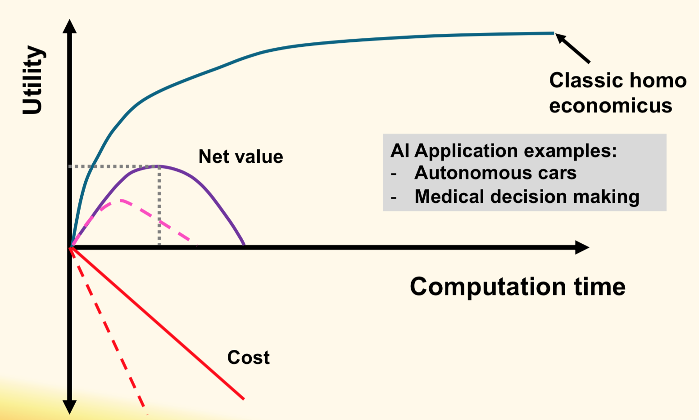
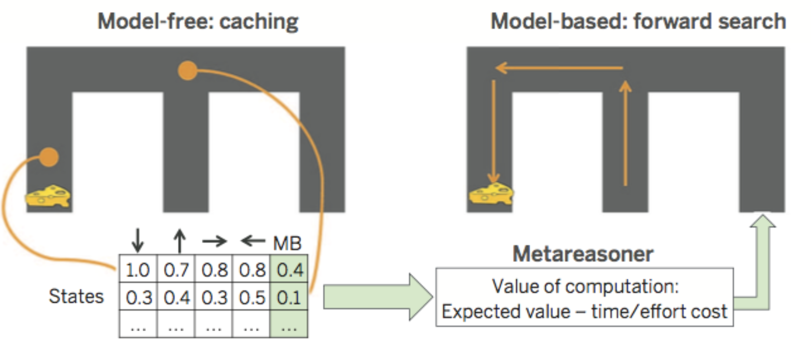

# Computational Rationality

## Computational Rationality in AI

	

## Computational Rationality in Cognitive Science

**Fallacies**
* Thinking Fast and Slow: https://en.wikipedia.org/wiki/Thinking,_Fast_and_Slow
* Wason selection task: https://en.wikipedia.org/wiki/Wason_selection_task
* Gambler’s fallacy: https://en.wikipedia.org/wiki/Gambler%27s_fallacy

## Computational Rationality in Neuroscience

	

## Process Model

The steps which the mind goes through:
* **Algorithmic theory** (Marr)
* **Cognitive band** (Newell)

Varieties:
* **ACT-R**
* **SOAR**
* **EPIC**
* **Cognitive Constraints**

**Process Model** = **Computational Rationality Model** helps to understand:
* **Why** (and **When**) such fallacies happen
* **What** causes those fallacies
* **How** they are implemented in the brain

**Computational Rationality** approaches:
- [ ] Type I: **Optimality**
- [ ] Type II: **Ecological optimality**
- [x] Type III: **Bounded-optimality**
- [x] Type IV: **Ecologically-bounded-optimality**

## Reference

* https://en.wikipedia.org/wiki/Homo_economicus
* https://en.wikipedia.org/wiki/Bounded_rationality
* https://en.wikipedia.org/wiki/Hippocampus
* https://en.wikipedia.org/wiki/Psychological_refractory_period
* https://en.wikipedia.org/wiki/Lexical_decision_task
