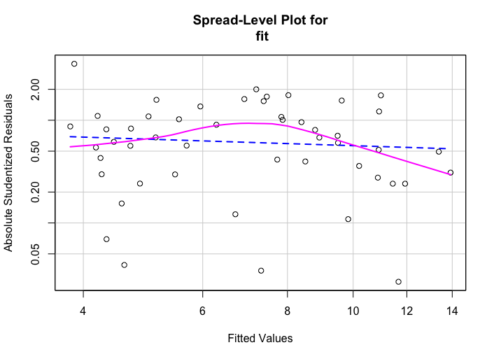
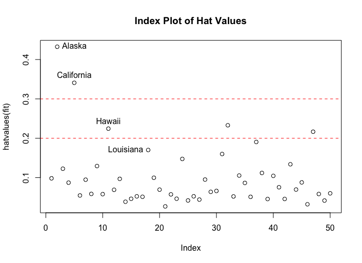
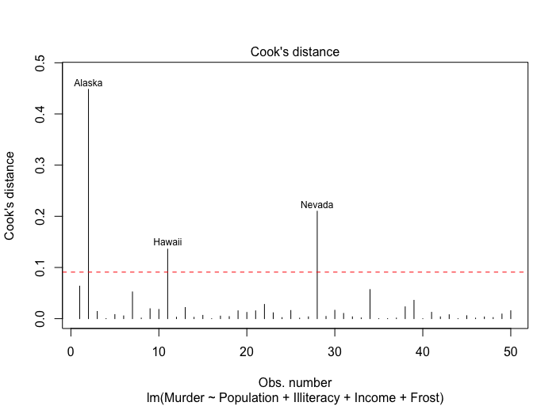
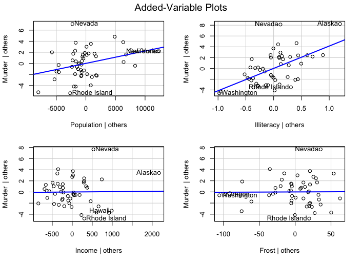

# Regression

## Overview

The regression analysis can be used to identify the **independent variables** that are related to a **dependent variable**:
* **describe** the form of the relationships involved
* **provide an equation** for **predicting** the response variable from the explanatory variables

The regression analysis will help answer such questions as below.

From a theoretical point of view:
* What is the relationship between exercise duration and calories burned? Is it linear or curvilinear?
* How does effort (e.g. the average walking speed, the percentage of time at the target heart rate) factor in?
* Are these relationships the same for young and old, male and female, heavy and slim?

From a practical point of view:
* How many calories can a 30-year-old man with a BMI of 28.7 expect to burn if he walks for 45 minutes at an average speed of 4 miles per hour and stays within his target heart rate 80% of the time?
* What is **the minimum number of variables** you need to collect in order to accurately predict the number of calories a person will burn when walking?
* **How accurate will your prediction tend to be?**

## Keywords

**Ordinary Least Squares (OLS) regression** is the most common variety of statistical analysis today including below types, other types of regression models include **logistic regression** and **Poisson regression**:
* **simple linear regression**: one dependent variable + one independent variable
* **polynomial regression**: one dependent variable + one independent variable including powers of this independent variable, e.g. X, X<sup>2</sup>, X<sup>3</sup>
* **multiple linear regression**: one dependent variable + more than one independent variable

## OLS regression

In OLS regression, **a quantitative dependent variable** is predicted from **a weighted sum of predictor variables**, where the weights are parameters estimated from the data.

the formula is as below:
* Y is the predicted value
* X is the predictor value
* β<sub>0</sub> is the intercept
* β<sub>j</sub> is the regression coefficient = slope

<p float="left">
	
</p>

Our goal is to **select model parameters (intercept and slopes)** that **minimize the difference** between actual response values and those predicted by the model.

The statistical assumptions must be satisfied:
* **Normality**: For fixed values of the independent variables, the dependent variable is normally distributed.
* **Independence**: The Y values are independent of each other.
* **Linearity**: The dependent variable is linearly related to the independent variables.
* **Heteroscedasticity**: The variance of the dependent variable doesn't vary with the levels of the independent variables = **constant variance**.

If you violate these assumptions, your **statistical significance tests** and **confidence intervals** may not be accurate.

## The lm() function

lm(formula, data = dataframe)
* response variable ~ predictor variable: e.g. y ~ A + B + C
* A:B denotes the interaction between variables: e.g. y ~ A + B + A:B
* A * B * C denotes the complete crossing variables: e.g. A * B * C = A + B + C + A:B + B:C + A:C + A:B:C
* (A + B + C)^2 denotes the crossing to a specified degree: e.g. (A + B + C)^2 = A + B + C + A:B + B:C + A:C
* y ~ . denotes a placeholder for all other variables in the data frame except the dependent variable: e.g. if a data frame contains x, y, z and w, then y ~ . = y ~ x + z + w
* - denotes removing a variable from the equation: e.g. y ~ (A + B + C)^2 - A:B = A + B + C + B:C + A:C
* -1 suppresses the intercept
* I() denotes that elements within the parentheses are interpreted arithmetically: e.g. y ~ A + I((B + C)^2) = y ~ A + h, where h = squaring the sum of B and C
* function: e.g. log(y) ~ A + B + C

Each of these functions is applied to the object returned by lm() in order to generate additional information:
* summary(): display detailed results for the fitted model
* coefficients(): list the model parameters (intercept and slopes)
* confint(): provide confidence intervals for the model parameters (95% by default)
* fitted(): list the predicted values in a fitted model
* residuals(): list the residual values in a fitted model
* anova(): generate an ANOVA table for a fitted model
* vcov(): list the covariance matrix for model parameters
* AIC(): print Akaike's Information Criterion
* plot(): generate diagnostic plots for evaluating the fit of a model
* predict(): use a fitted model to predict response values for a new dataset

## Source code

### Simple linear regression

```
options(scipen = 999)

fit <- lm(weight ~ height, data = women)
summary(fit)

plot(women$height, women$weight, 
     xlab = "Height (in inches)", ylab = "Weight (in pounds)")

abline(fit)
```

**analysis of the result**:
* regression coefficient (3.45) is significantly different from zero (p < 0.001) and indicates that there is an expected increase of 3.45 pounds of weight for every 1 inch increase in height
* the multiple R-squared (0.991) indicates that the model accounts for 99.1% of the variance in weights
* the multiple R-squared is also the **squared correlation** between the actual and predicted value, which can be thought of as the **average error** in predicting weight from height using this model
* the **F statistic** tests whether the predictor variables, taken together, predict the response variable **above chance levels**

<p float="left">
	
</p>

```
Call:
lm(formula = weight ~ height, data = women)

Residuals:
    Min      1Q  Median      3Q     Max 
-1.7333 -1.1333 -0.3833  0.7417  3.1167 

Coefficients:
             Estimate Std. Error t value           Pr(>|t|)    
(Intercept) -87.51667    5.93694  -14.74 0.0000000017110819 ***
height        3.45000    0.09114   37.85 0.0000000000000109 ***
---
Signif. codes:  0 ‘***’ 0.001 ‘**’ 0.01 ‘*’ 0.05 ‘.’ 0.1 ‘ ’ 1

Residual standard error: 1.525 on 13 degrees of freedom
Multiple R-squared:  0.991,	Adjusted R-squared:  0.9903 
F-statistic:  1433 on 1 and 13 DF,  p-value: 0.00000000000001091

```

<p float="left">
	
</p>


### Polynomial regression

```
fit2 <- lm(weight ~ height + I(height^2), data = women)
summary(fit2)

plot(women$height, women$weight, 
     xlab = "Height (in inches)", ylab = "Weight (in pounds)")

lines(women$height, fitted(fit2))
```

**analysis of the result**:
* both regression coefficients are significant at the p < 0.0001 level
* the amount of variance accounted for has increased to 99.9%
* the inclusion of the quadratic term improves the model fit

<p float="left">
	
</p>

```
Call:
lm(formula = weight ~ height + I(height^2), data = women)

Residuals:
     Min       1Q   Median       3Q      Max 
-0.50941 -0.29611 -0.00941  0.28615  0.59706 

Coefficients:
             Estimate Std. Error t value      Pr(>|t|)    
(Intercept) 261.87818   25.19677  10.393 0.00000023569 ***
height       -7.34832    0.77769  -9.449 0.00000065845 ***
I(height^2)   0.08306    0.00598  13.891 0.00000000932 ***
---
Signif. codes:  0 ‘***’ 0.001 ‘**’ 0.01 ‘*’ 0.05 ‘.’ 0.1 ‘ ’ 1

Residual standard error: 0.3841 on 12 degrees of freedom
Multiple R-squared:  0.9995,	Adjusted R-squared:  0.9994 
F-statistic: 1.139e+04 on 2 and 12 DF,  p-value: < 0.00000000000000022
```

<p float="left">
	
</p>

### Multiple linear regression

```
states <- as.data.frame(state.x77[, c("Murder", "Population", "Illiteracy", "Income", "Frost")])

cor(states)

library(car)
scatterplotMatrix(states, 
                  spread = FALSE, 
                  smoother.args = list(ltyp = 2), 
                  main = "Scatter Plot Matrix")

fit <- lm(Murder ~ Population + Illiteracy + Income + Frost, data = states)
summary(fit)
```

**analysis of the result**:
* a good first step in multiple linear regression is to examine the relationship among the variables two at a time
* the **bivariate correlations** are provided by the cor() function

```
               Murder Population Illiteracy     Income      Frost
Murder      1.0000000  0.3436428  0.7029752 -0.2300776 -0.5388834
Population  0.3436428  1.0000000  0.1076224  0.2082276 -0.3321525
Illiteracy  0.7029752  0.1076224  1.0000000 -0.4370752 -0.6719470
Income     -0.2300776  0.2082276 -0.4370752  1.0000000  0.2262822
Frost      -0.5388834 -0.3321525 -0.6719470  0.2262822  1.0000000
```

**analysis of the result**:
* murder rates rise with population and illiteracy, and they fall with higher income levels and frost

<p float="left">
	
</p>

**analysis of the result**:
* the regression coefficient for Illiteracy is 4.14, suggesting that an increase of 1% in illiteracy is associated with a 4.14% increase in the murder rate, controlling for population, income and frost
* this coefficient is significantly different from zero at the p < 0.0001 level

```
Call:
lm(formula = Murder ~ Population + Illiteracy + Income + Frost, 
    data = states)

Residuals:
    Min      1Q  Median      3Q     Max 
-4.7960 -1.6495 -0.0811  1.4815  7.6210 

Coefficients:
              Estimate Std. Error t value  Pr(>|t|)    
(Intercept) 1.23456341 3.86611474   0.319    0.7510    
Population  0.00022368 0.00009052   2.471    0.0173 *  
Illiteracy  4.14283659 0.87435319   4.738 0.0000219 ***
Income      0.00006442 0.00068370   0.094    0.9253    
Frost       0.00058131 0.01005366   0.058    0.9541    
---
Signif. codes:  0 ‘***’ 0.001 ‘**’ 0.01 ‘*’ 0.05 ‘.’ 0.1 ‘ ’ 1

Residual standard error: 2.535 on 45 degrees of freedom
Multiple R-squared:  0.567,	Adjusted R-squared:  0.5285 
F-statistic: 14.73 on 4 and 45 DF,  p-value: 0.00000009133
```

### Multiple linear regression with interactions

```
fit <- lm(mpg ~ hp + wt + hp:wt, data = mtcars)
summary(fit)

library(effects)

# effect(term, model,, xlevels)
plot(effect("hp:wt", fit, , list(wt=c(2.2, 3.2, 4.2))), multiline = TRUE)
```

**analysis of the result**:
* the interaction between horsepower and car weight is significant
* **a significant interaction between two predictor variables** tells you that the relationship between one predictor and the response variable **depends on the level of the other predictor**

<p float="left">
	
</p>

```
Call:
lm(formula = mpg ~ hp + wt + hp:wt, data = mtcars)

Residuals:
    Min      1Q  Median      3Q     Max 
-3.0632 -1.6491 -0.7362  1.4211  4.5513 

Coefficients:
            Estimate Std. Error t value           Pr(>|t|)    
(Intercept) 49.80842    3.60516  13.816 0.0000000000000501 ***
hp          -0.12010    0.02470  -4.863 0.0000403624302068 ***
wt          -8.21662    1.26971  -6.471 0.0000005199287280 ***
hp:wt        0.02785    0.00742   3.753           0.000811 ***
---
Signif. codes:  0 ‘***’ 0.001 ‘**’ 0.01 ‘*’ 0.05 ‘.’ 0.1 ‘ ’ 1

Residual standard error: 2.153 on 28 degrees of freedom
Multiple R-squared:  0.8848,	Adjusted R-squared:  0.8724 
F-statistic: 71.66 on 3 and 28 DF,  p-value: 0.0000000000002981
```

<p float="left">
	
</p>

## Regression diagnostics

```
states <- as.data.frame(state.x77[, c("Murder", "Population", "Illiteracy", "Income", "Frost")])

fit <- lm(Murder ~ Population + Illiteracy + Income + Frost, data = states)
confint(fit)
```

**analysis of the result**:
* you can be 95% confident that the interval [2.38, 5.90] contains the true change in murder rate for a 1% change in illiteracy rate
* the confidence interval for Frost contains 0, which means a change in temperature is unrelated to murder rate, holding the other variables constant

```
                     2.5 %       97.5 %
(Intercept) -6.55219139253 9.0213182149
Population   0.00004136397 0.0004059867
Illiteracy   2.38179886128 5.9038743192
Income      -0.00131261059 0.0014414600
Frost       -0.01966780591 0.0208304170
```

### Normality

```
library(car)

states <- as.data.frame(state.x77[, c("Murder", "Population", "Illiteracy", "Income", "Frost")])

fit <- lm(Murder ~ Population + Illiteracy + Income + Frost, data = states)

qqPlot(fit, 
       labels = row.names(states), 
       id.method = "identify", 
       simulate = TRUE, 
       main = "Q-Q Plot")


states["Nevada",]
fitted(fit)["Nevada"]
residuals(fit)["Nevada"]
```

**analysis of the result**:
* all the points fall close to the line and are within the confidence envelope
* you've met the normality assumption
* Nevada has a large positive residual (actual - predicted), indicating that the model underestimates the murder rate in this state

<p float="left">
	
</p>

### Independence

time series data often display **autocorrelation**:
* observations collected closer in time are more correlated with each other than with observations distant in time

```
durbinWatsonTest(fit)
```

**analysis of the result**:
* the nonsignificant p-value (0.242) suggests a lack of autocorrelation and, conversely an independence of errors
* the lag value (1) indicates that each observation is being compared with the one next to it in the dataset

```
 lag Autocorrelation D-W Statistic p-value
   1      -0.2006929      2.317691   0.242
 Alternative hypothesis: rho != 0
```

### Linearity

you can look for evidence of nonlinearity in the relationship between the dependent variable and independent variables by using **component plus residual plots (partial residual plots)**

```
library(car)

crPlots(fit)
```

<p float="left">
	
</p>

### Heteroscedasticity

The ncvTest() function produces a score test of the hypothesis of constant error variance against the alternative that the error variance changes with the level of the fitted values, and a significant result suggests heteroscedasticity

```
library(car)

ncvTest(fit)
spreadLevelPlot(fit)
```

**analysis of the result**:
* the score test is nonsignificant (p = 0.19), suggesting that you've met the constant variable assumption
* in the spread-level plot, the points form a random horizontal band around a horizontal line of best fit. If you violate this assumption, you'd expect to see a nonhorizontal line

```
Non-constant Variance Score Test 
Variance formula: ~ fitted.values 
Chisquare = 1.746514, Df = 1, p = 0.18632
```

<p float="left">
	
</p>


### The gvlma() function
 
```
library(gvlma)

gvmodel <- gvlma(fit)
summary(gvmodel)
```

```
Call:
lm(formula = Murder ~ Population + Illiteracy + Income + Frost, 
    data = states)

Residuals:
    Min      1Q  Median      3Q     Max 
-4.7960 -1.6495 -0.0811  1.4815  7.6210 

Coefficients:
              Estimate Std. Error t value  Pr(>|t|)    
(Intercept) 1.23456341 3.86611474   0.319    0.7510    
Population  0.00022368 0.00009052   2.471    0.0173 *  
Illiteracy  4.14283659 0.87435319   4.738 0.0000219 ***
Income      0.00006442 0.00068370   0.094    0.9253    
Frost       0.00058131 0.01005366   0.058    0.9541    
---
Signif. codes:  0 ‘***’ 0.001 ‘**’ 0.01 ‘*’ 0.05 ‘.’ 0.1 ‘ ’ 1

Residual standard error: 2.535 on 45 degrees of freedom
Multiple R-squared:  0.567,	Adjusted R-squared:  0.5285 
F-statistic: 14.73 on 4 and 45 DF,  p-value: 0.00000009133


ASSESSMENT OF THE LINEAR MODEL ASSUMPTIONS
USING THE GLOBAL TEST ON 4 DEGREES-OF-FREEDOM:
Level of Significance =  0.05 

Call:
 gvlma(x = fit) 

                    Value p-value                Decision
Global Stat        2.7728  0.5965 Assumptions acceptable.
Skewness           1.5374  0.2150 Assumptions acceptable.
Kurtosis           0.6376  0.4246 Assumptions acceptable.
Link Function      0.1154  0.7341 Assumptions acceptable.
Heteroscedasticity 0.4824  0.4873 Assumptions acceptable.
```

## Unusual observations

### Outliers

* outliers are observations that aren't predicted well by the model
* they have unusually large **positive or negative residuals (Y - Y')**
* positive residuals indicate that the model is underestimating the response value
* negative residuals indicate that the model is overestimating the response value
* points in the Q-Q plot that lie **outside the confidence band** are considered outliers
* **standardized residuals that are larger than 2 or less than -2** are worth attention

```
library(car)

outlierTest(fit)
```

Nevada is identified as an outlier (p = 0.048)
```
       rstudent unadjusted p-value Bonferroni p
Nevada 3.542929         0.00095088     0.047544
```

### High-leverage observations

* high-leverage observations have an unusual combination of predictor values
* observations with high leverage are identified through the **hat statistic**
* for a given dataset, **the average hat value is p/n**, where p is the number of parameters (including the intercept) estimated in the model, n is the sample size
* an observation with **a hat value greater than 2 or 3 times the average hat** should be examined

```
p <- length(coefficients(fit))
n <- length(fitted(fit))

plot(hatvalues(fit), main = "Index Plot of Hat Values")
abline(h = c(2,3)*p/n, col = "red", lty = 2)

identify(1:n, hatvalues(fit), names(hatvalues(fit))) #interactive mode
```

**analysis of the result**:
* Alaska and California are particularly unusual when it comes to their predictor values
* Alaska has a much higher income than other states, while having a lower population and temperature
* California has a much higher population than other states, while having a higher income and higher temperature
* These states are atypical compared with other 48 observations

<p float="left">
	
</p>


**Influential observations**

* influential observations = high-leverage observations + outliers
* influential observations impact on the values of the model parameters 
* the model will change dramastically with the removal of a single observation
* **Cook's D values greater than 4/(n-k-1)**, where n is the sample size, k is the number of predictor variables, indicate influential observations

```
cutoff <- 4 / (nrow(states) - length(fit$coefficients) - 1)

plot (fit, which = 4, cook.levels = cutoff)
abline(h = cutoff, lty = 2, col = "red")

library(car)
avPlots(fit, ask =  FALSE, id.method = "identify")
```

<p float="left">
	
</p>

<p float="left">
	
</p>
