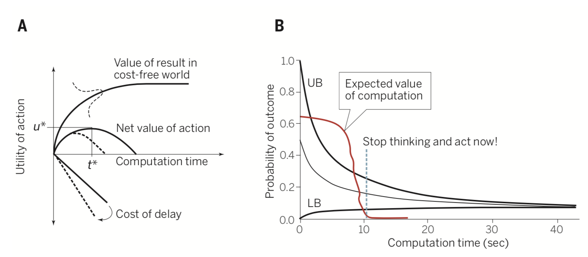
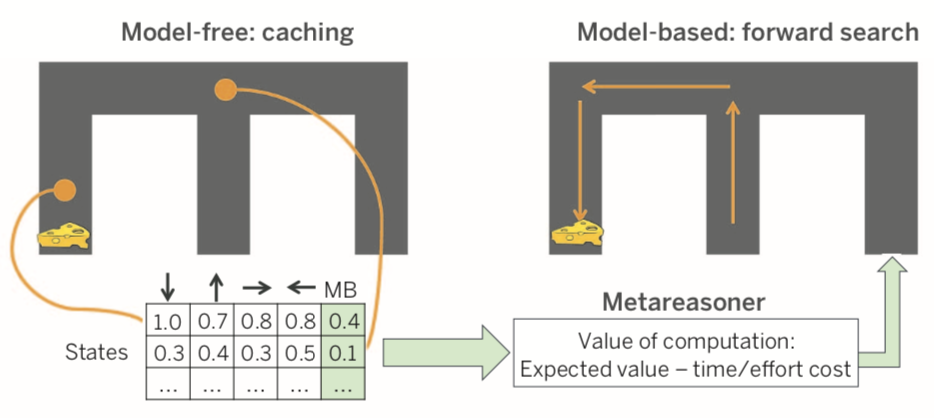
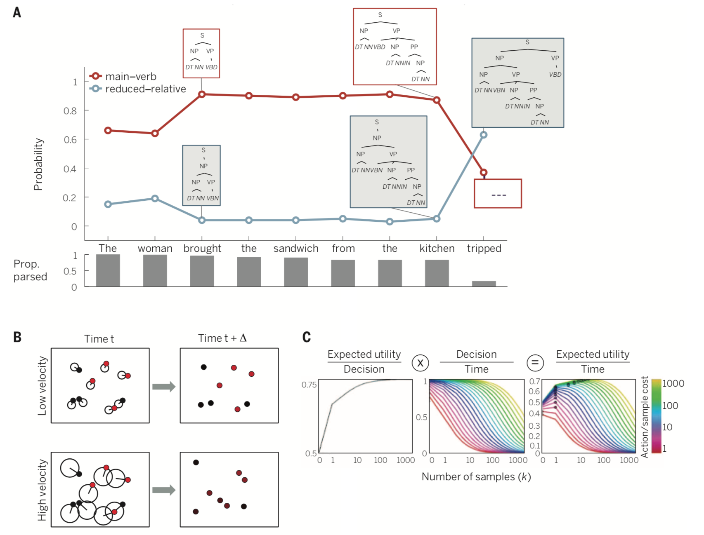

# Summary

**computational rationality**
* intelligent agents seek to form beliefs and plan actions in support of **Maximum Expected Utility (MEU)**.
* ideal MEU calculation may be intractable for real-world problems, but can be effectively **approximated** by rational algorithms incorporating the **costs of computation**.
* these algorithms can be adapted to the organism's specific needs, either **offline through engineering or evolutionary design**, or **online through metareasoning mechanism** for selecting the best approximation strategy in a given situation.

**metareasoning**
* tradeoff between **time** and **accuracy**.
* the brain is equipped with metareasoning mechanism sensitive to the costs of cognition.

	
	

**sequential decision-making**
* **arbitration mechanism** is based on computational rationality
	* **model-based system** = online
		* Monte Carlo Tree Search (MCTS) - **hippocampus**
	* **model-free system** = offline (habits)
		* deep neural network
* arbitration mechanism may be supported by **lateral prefrontal cortex**

**decision-theoretic methods**
* probabilistic
* Bayesian network of variables - updating
* bounded rationality < MEU

**sampling hypothesis**
* **sampling-based approximation** converges to the **true posterior**, as more hypotheses are sampled.
* humans use this strategy across several domains:
	* causal reasoning
	* category learning
	* perception
	* bias
* sampling algorithms:
	* **particle filters**: **sequential sampling algorithm** for tracking multiple objects moving in a dynamic uncertain environment, e.g. Google self-driving car.
	* **garden path effects** in sentence processing.

	

