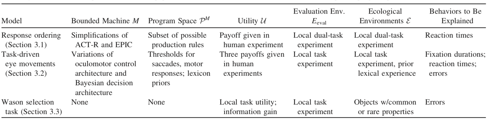

# Summary

a separation between:
* **higher rational levels** that identify goals (**"why" explanations of behavior**)
* **lower mechanism levels** that approximately implement those goals (**"how" explanations of behavior**)

	

**computational rationality**
* an alternative view of how **rational analysis** links mechanism and behavior, based on **bounded optimality**.
* it therefore requires a **bounded rational analysis**
* it defines and solves an **optimal program problem**
* behaviors are generated by organism-internal constructs - **programs**, as programs compute **behavior policies**.
* programs are shaped by both **information-processing mechanisms** and **environment structure**.

	

**optimal program problem**

it demands three inputs:
* **a bounded agent**
* **an adaptation** or **ecological environment**
* **a utility function**

the solution to an optimal program problem is the **optimal program**:
* executed on the bounded agent 
	* **bounded information-processing agents**: the behavior is influenced by **history**, thus allowing for **learning**
* in the given adaptation or ecological environment
* maximize utility
	* **task goals**
	* **internal subjective utility**
	* **speed-accuracy trade-offs**

**explanations**:
* **optimality (Type I)**: it can be thought of as **rational analysis** in which only the **local evaluation environment** plays a role in determing behavior.
* **ecological optimality (Type II)**: it can be thought of as **rational analysis** in which **ecological environments of adaptation** have shaped behavior, e.g. Wason selection task.
* **bounded optimality (Type III)**: e.g. Psychological Refractory Period (PRP) task.
* **ecologically bounded optimality (Type IV)**: e.g. List Lexical Decision Task (LLDT).

	

**Psychological Refractory Period (PRP)** example:
* the **bounded optimal programs for the serial bounded machine** are a better predictor of the human data than the **bounded optimal program for the parallel bounded machine**.

	
	

**List Lexical Decision Task (LLDT)** example:
* the payoff surface for all three utilities is expressed over one of the behavioral outcomes: **single fixation durations (SFDs)**.

	
	
	

