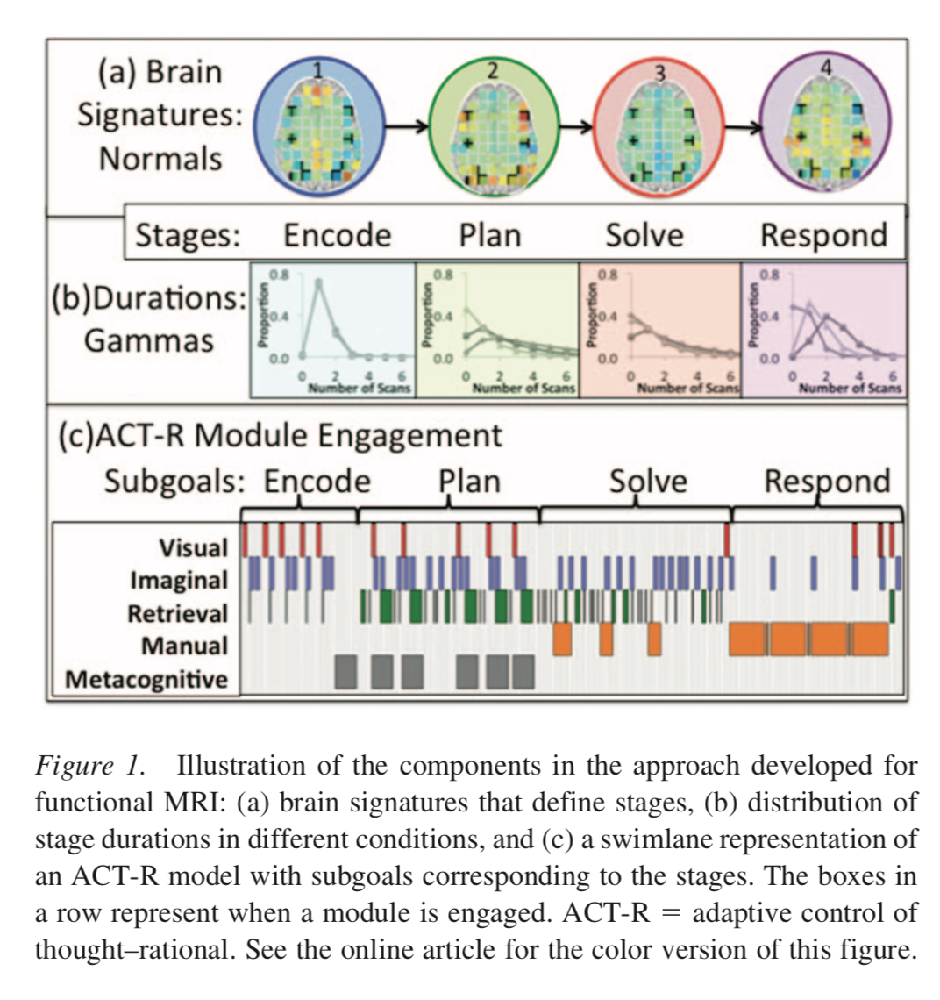
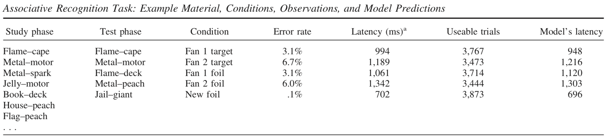
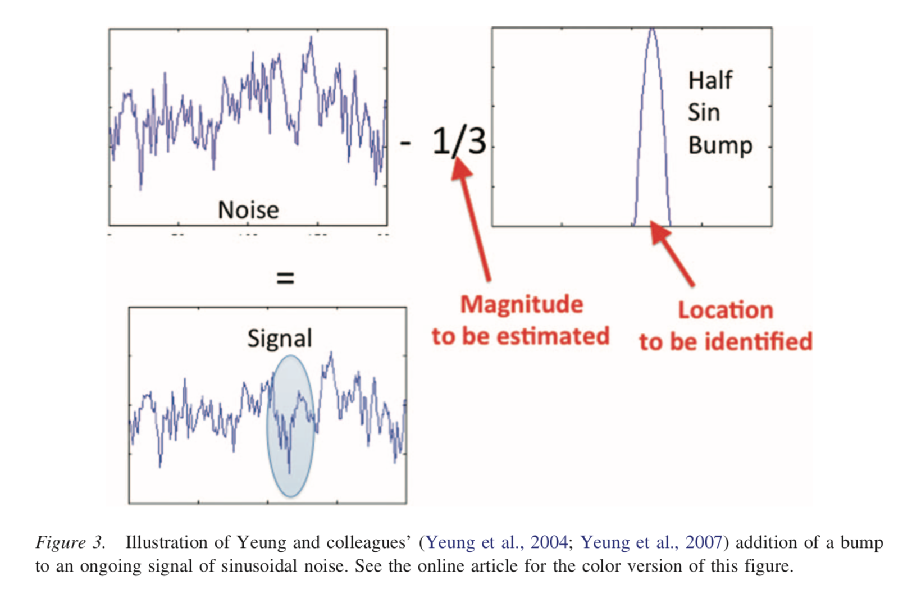
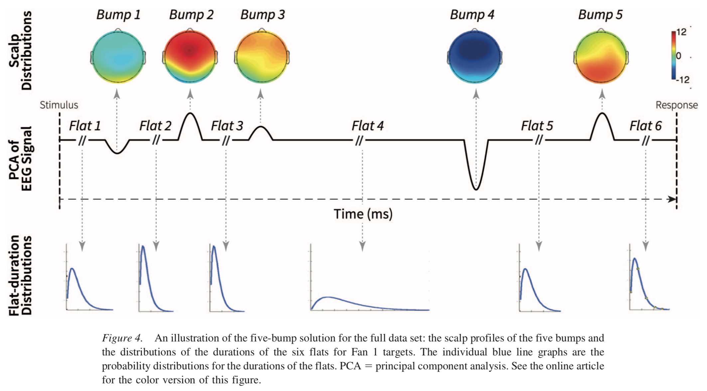
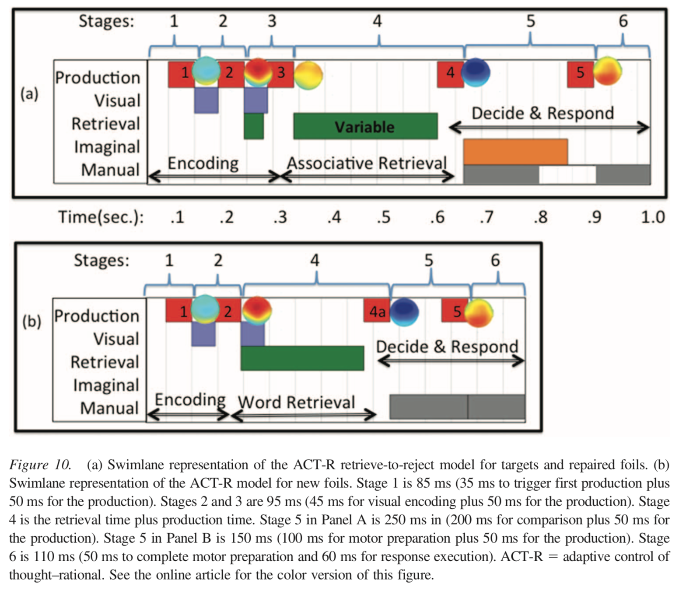
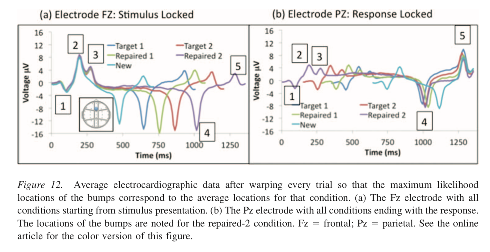

# Summary

## Keywords

**mass-univariate** approach vs **MVPA** (**MultiVariate Pattern Analysis**)
* mass-univariate approach assumes that **single voxels (fMRI)** or **sensors (EEG, MEG)** carry the relevant information.
* MVPA looks at **distributed patterns** of brain activity **across voxels or sensors**.

HMM (Hidden Markov Model) vs HSMM (Hidden Semi Markov Model)
* HMM simulates a system that is in one of a distinct set of states at any time, and **transitions to a new state at certain times**.
* in HSMM analysis, each state corresponds to a processing stage, and **processing stages' durations are variable**. A **variable-duration HMM** is also known as an HSMM.

the HSMM-MVPA method identifies four distinct processing stages:
* **an encoding stage**: participants perceive the problem.
* **a planning stage**: participants plan a solution path.
* **a solving stage**: participants calculate the solution.
* **a responding stage**: participants enter the response.

**brain signature**
* the brain pattern across voxels or sensors that defines a stage.

**PCA (Principle Component Analysis)**
* PCA is based on the raw voxel data.
* the first 20 PCA components are retained, which account for two thirds of the variance in the raw voxel data.
* the MVPA estimates patterns in this 20 dimensional space.
* **a brain signature** is a constant activity pattern across **a number of PCA components**, rather than across raw voxel data.
* **PCA weights** define the brain signature.

**ACT-R (Adaptive Control of Thought-Rational)**
* a process model that explains **what is happening in the processing stages**.
* it involves the interaction of five modules:
	* **a visual module**: encode the problem and track the response output.
	* **an imaginal module**: hold and transform problem representations during problem solving.
	* **a retrieval module**: retrieve information about problem type and general arithmetic facts.
	* **a manual module**: controll hand movements
	* **a metacognitive module**: hold and transform information about solution methods.

	

**bottom-up HSMM vs HSMM based on ACT-R model**
* model-based HSMM contains far fewer parameters.
* model-based HSMM better accounts for the data.

## Associative Recognition Task
* **fan 1** pair: each word appears only in this pair.
* **fan 2** pair: each word appears in two pairs.
* **target**: two words in the pair were previously studied together.
* **repaired foil**: two words in the pair were previously studied separately.
* **new foil**: two novel words were previously NOT studied.

	

**bump**: 
* **multi-dimensional distributions of scalp activity** that begin to rise with the onset of a significant cognitive event.
* **bump** = **brain signature**

	

## EEG with HSMM-MVPA based on ACT-R

	
	
	

